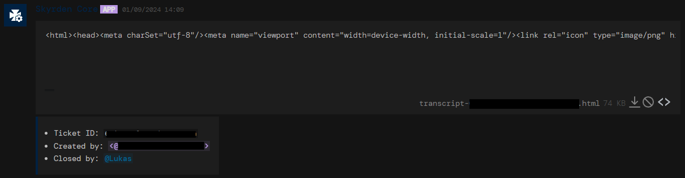

# Projects
Here are most of my projects, or projects that I have participated in significantly.

 

> Please note that I am not currently taking commissions, however feel free to contact me [here](contact) if you have a job opportunity

	<a href="#skyrden-core">skyrden core</a>
	<a href="#citrine">citrine</a>

---

	<i>Most images are cropped, click them to view fully</i>

## <a href="https://github.com/ThatSirWaffles/core" target="_blank">Skyrden Core</a> &nbsp; 
A bespoke multipurpose Discord bot developed for [Skyrden](https://discord.gg/skyrden), created circa 2021, rewritten 3 times to the state it is in now. Since I left, the bot has been handed off to another maintainer, and the linked repo is an archive of the final state I left it in.

[•] Full ticket system with ticket claiming, snippets, bans and transcripts|
[•] Roblox-Discord user linking system|
[•] Cross platform points system, earned on Roblox, displayed on Discord|
[•] Basic community activity features|
[•] Semi automated flight status announcements from Roblox|
[•] Hooks with another piece of Skyrden's infrastructure, the [Staff Hub](https://staff.skyrden.com)|
[•] API to control most features of the bot externally, notably from the Staff Hub|

	

		
		
	

	

		
		
		
	

---

## [Citrine](https://github.com/ThatSirWaffles/citrine)
A work in progress replacement for the Roblox desktop app, built with [electron-vite](https://electron-vite.org/), [React](https://react.dev/) and [shadcn/ui](https://ui.shadcn.com/).

	

		
	

