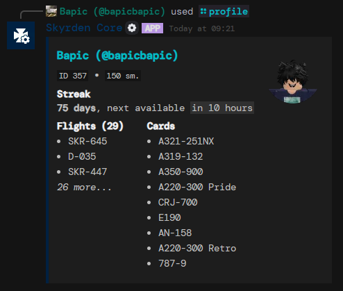
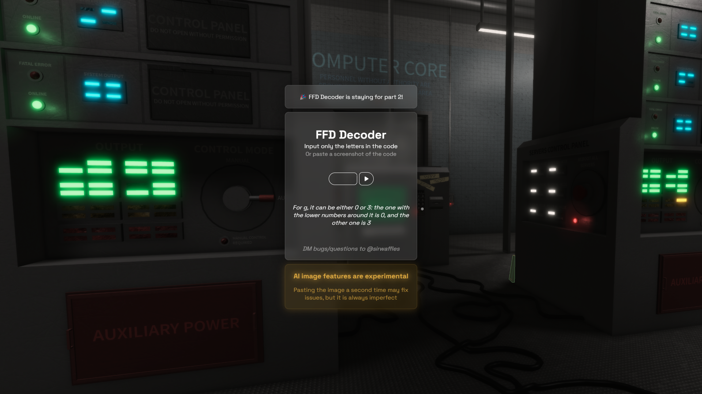
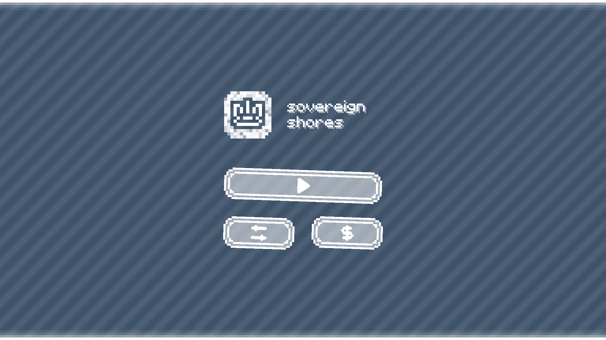

# Projects
Here are most of my projects, or projects that I have participated in significantly.

 

> Please note that I am not currently taking commissions, however feel free to contact me [here](contact) if you have a job opportunity

	<a href="#skyrden-core">skyrden core</a>
	<a href="#ffd-decoder">ffd decoder</a>
	<a href="#sovereign-shores">sovereign shores</a>
	<a href="#citrine">citrine</a>

---

	<i>Most images are cropped, click them to view fully</i>

<h2 id="skyrden-core" style="display: flex; gap: 10px">Skyrden Core&nbsp;
	

		Node.js
	

	

		Discord
	

	

		Github
	

</h2>

A bespoke multipurpose Discord bot developed for [Skyrden](https://discord.gg/skyrden), created circa late 2021, rewritten 3 times to the state it is in now. Since I left, the bot has been handed off to another maintainer, and the linked repo is an archive of the final state I left it in.

[•] | Full ticket system with ticket claiming, snippets, bans and transcripts|
[•] | Roblox-Discord user linking system|
[•] | Cross platform points system, earned on Roblox, displayed on Discord|
[•] | Basic community activity features|
[•] | Semi automated flight status announcements from Roblox|
[•] | Hooks with another piece of Skyrden's infrastructure, the [Staff Hub](https://staff.skyrden.com)|
[•] | API to control most features of the bot externally, notably from the Staff Hub|

	

		
		
	

	

		
		
		
	

---

<h2 id="ffd-decoder" style="display: flex; gap: 10px">FFD Decoder&nbsp;
	

		Svelte
	

	

		Node.js
	

	

		Gemini API
	

	

		Website
	

	

		Github
	

</h2>

A tool to decode the encrypted FFD codes in the game CPUF, made entirely for fun and community use.	Created April 2024.

[•] | Follows a simple algorithm to decrypt 4/6 digit FFD codes|
[•] | Allows for automated decryption from a screenshot of the in-game code|
[•] | Uses Google's Gemini API as better OCR|

	

		
	

---

<h2 id="sovereign-shores" style="display: flex; gap: 10px">Sovereign Shores&nbsp;
	

		Roblox Studio
	

	

		Figma
	

	

		Discord
	

</h2>

A work-in-progress open-world game, based in medieval times, in an archipelago of individual sovereign islands, all fighting for the upper hand. 

[•] | Each island has its own laws, system of government and economy|
[•] | Different social classes based on wealth and role|
[•] | Purchasable and customizable houses|
[•] | Trading of resources that islands rely on for survival|
[•] | A single "seamless" map that would be realistically sailable|

	

		
	

---

<h2 id="citrine" style="display: flex; gap: 10px">Citrine&nbsp;
	

		electron-vite
	

	

		React
	

	

		Figma
	

	

		Github
	

</h2>

A work-in-progress replacement for the Roblox desktop app, which will hopefully offer a nicer UI and UX, while improving game recommendation, created around September 2024. The following features are planned:

[•] | Weekly community votes to discover underrated games|
[•] | Tailored feed of games based on interests|
[•] | Filter to remove cash grabs/low effort games|
[•] | Personal and publishable game collections|

	

		
	

